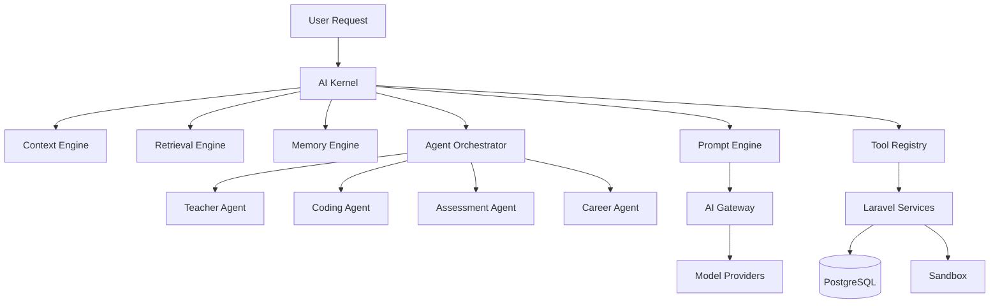
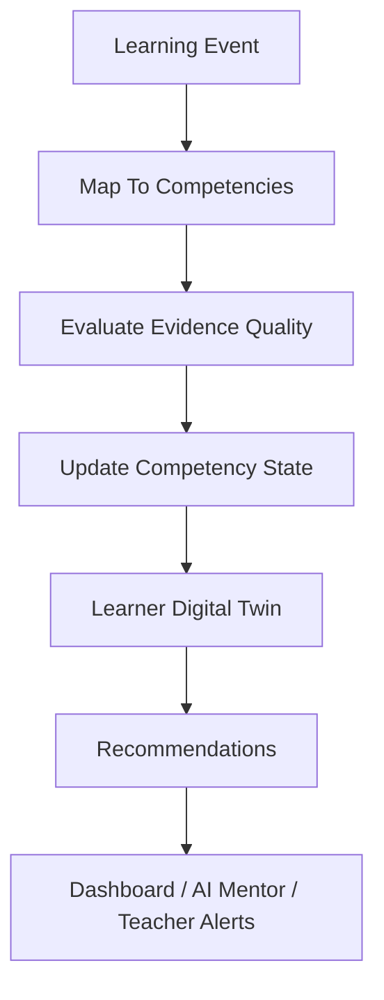
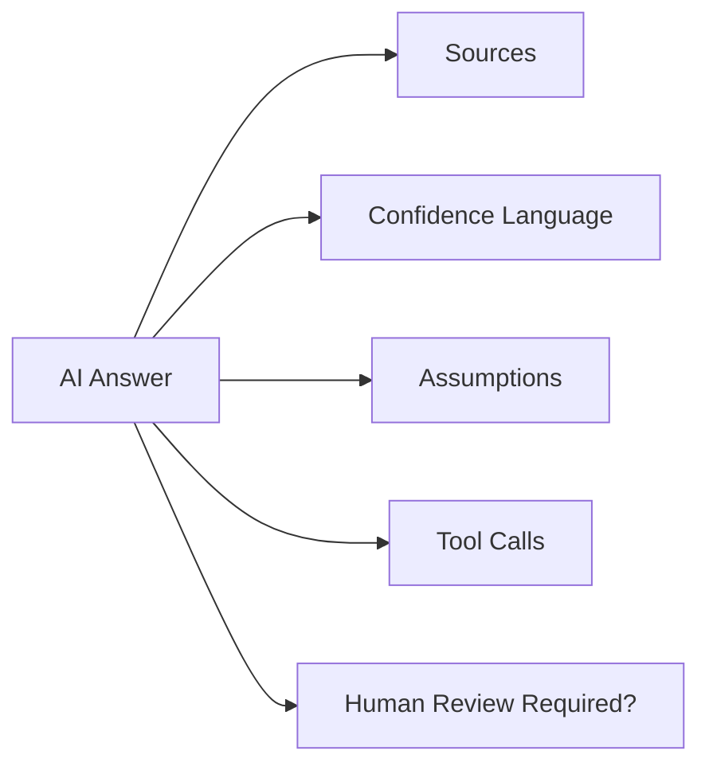

# AI Kernel And Learning Genome Diagrams

## AI Kernel

```mermaid
flowchart TD
    U[User Request] --> K[AI Kernel]
    K --> C[Context Engine]
    K --> R[Retrieval Engine]
    K --> M[Memory Engine]
    K --> P[Prompt Engine]
    K --> T[Tool Registry]
    K --> O[Agent Orchestrator]
    O --> TA[Teacher Agent]
    O --> CA[Coding Agent]
    O --> AA[Assessment Agent]
    O --> CRA[Career Agent]
    P --> G[AI Gateway]
    G --> LLM[Model Providers]
    T --> LS[Laravel Services]
    LS --> DB[(PostgreSQL)]
    LS --> S[Sandbox]
```

## Learning Genome Update Flow

```mermaid
flowchart TD
    E[Learning Event] --> MAP[Map To Competencies]
    MAP --> Q[Evaluate Evidence Quality]
    Q --> STATE[Update Competency State]
    STATE --> TWIN[Learner Digital Twin]
    TWIN --> REC[Recommendations]
    REC --> DASH[Dashboard / AI Mentor / Teacher Alerts]
```

## AI Trust Layer

```mermaid
flowchart LR
    A[AI Answer] --> S[Sources]
    A --> C[Confidence Language]
    A --> ASS[Assumptions]
    A --> TOOLS[Tool Calls]
    A --> REVIEW[Human Review Required?]
```
