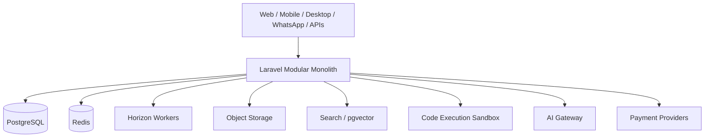
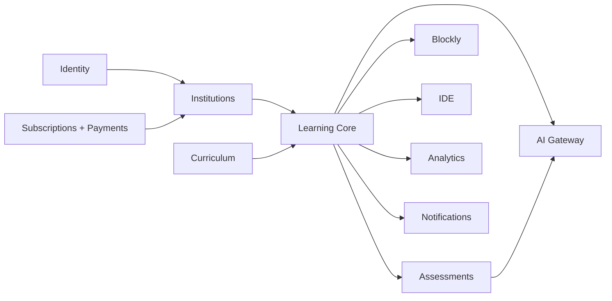
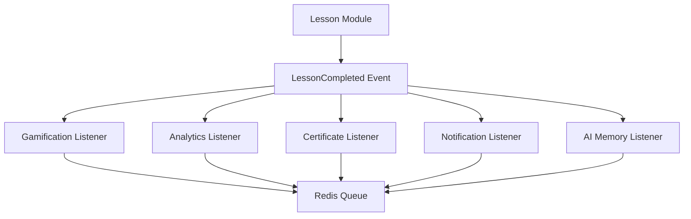
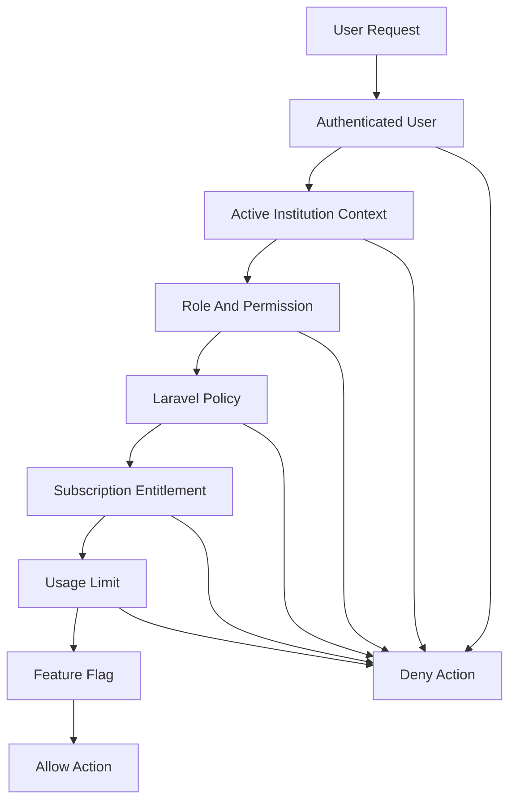
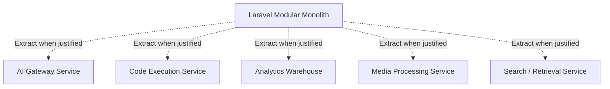

# Backend Architecture Diagrams

## Modular Monolith

```mermaid
flowchart TD
    Clients[Web / Mobile / Desktop / WhatsApp / APIs]
    App[Laravel Modular Monolith]
    DB[(PostgreSQL)]
    Redis[(Redis)]
    Horizon[Horizon Workers]
    Storage[Object Storage]
    Search[Search / pgvector]
    Sandbox[Code Execution Sandbox]
    AI[AI Gateway]
    Payments[Payment Providers]

    Clients --> App
    App --> DB
    App --> Redis
    App --> Horizon
    App --> Storage
    App --> Search
    App --> Sandbox
    App --> AI
    App --> Payments
```

## Module Boundaries

```mermaid
flowchart LR
    Identity[Identity]
    Institutions[Institutions]
    Learning[Learning Core]
    Curriculum[Curriculum]
    Assessment[Assessments]
    AI[AI Gateway]
    Blockly[Blockly]
    IDE[IDE]
    Billing[Subscriptions + Payments]
    Analytics[Analytics]
    Notifications[Notifications]

    Identity --> Institutions
    Institutions --> Learning
    Curriculum --> Learning
    Learning --> Assessment
    Learning --> Blockly
    Learning --> IDE
    Learning --> AI
    Assessment --> AI
    Billing --> Institutions
    Learning --> Analytics
    Learning --> Notifications
```

## Event-Driven Lesson Completion

```mermaid
flowchart TD
    Lesson[Lesson Module]
    Event[LessonCompleted Event]
    XP[Gamification Listener]
    Analytics[Analytics Listener]
    Cert[Certificate Listener]
    Notify[Notification Listener]
    Memory[AI Memory Listener]
    Queue[Redis Queue]

    Lesson --> Event
    Event --> XP
    Event --> Analytics
    Event --> Cert
    Event --> Notify
    Event --> Memory
    XP --> Queue
    Analytics --> Queue
    Cert --> Queue
    Notify --> Queue
    Memory --> Queue
```

## Authorization Flow

```mermaid
flowchart TD
    Request[User Request]
    Auth[Authenticated User]
    Tenant[Active Institution Context]
    Role[Role And Permission]
    Policy[Laravel Policy]
    Entitlement[Subscription Entitlement]
    Limit[Usage Limit]
    Feature[Feature Flag]
    Allow[Allow Action]
    Deny[Deny Action]

    Request --> Auth
    Auth --> Tenant
    Tenant --> Role
    Role --> Policy
    Policy --> Entitlement
    Entitlement --> Limit
    Limit --> Feature
    Feature --> Allow
    Auth --> Deny
    Tenant --> Deny
    Role --> Deny
    Policy --> Deny
    Entitlement --> Deny
    Limit --> Deny
```

## Future Service Extraction

```mermaid
flowchart TD
    Monolith[Laravel Modular Monolith]
    AIService[AI Gateway Service]
    SandboxService[Code Execution Service]
    AnalyticsService[Analytics Warehouse]
    MediaService[Media Processing Service]
    SearchService[Search / Retrieval Service]

    Monolith -. Extract when justified .-> AIService
    Monolith -. Extract when justified .-> SandboxService
    Monolith -. Extract when justified .-> AnalyticsService
    Monolith -. Extract when justified .-> MediaService
    Monolith -. Extract when justified .-> SearchService
```
