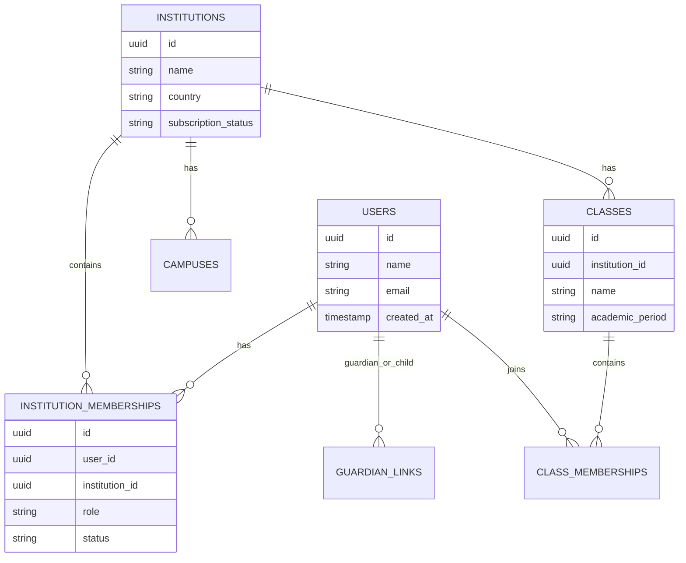
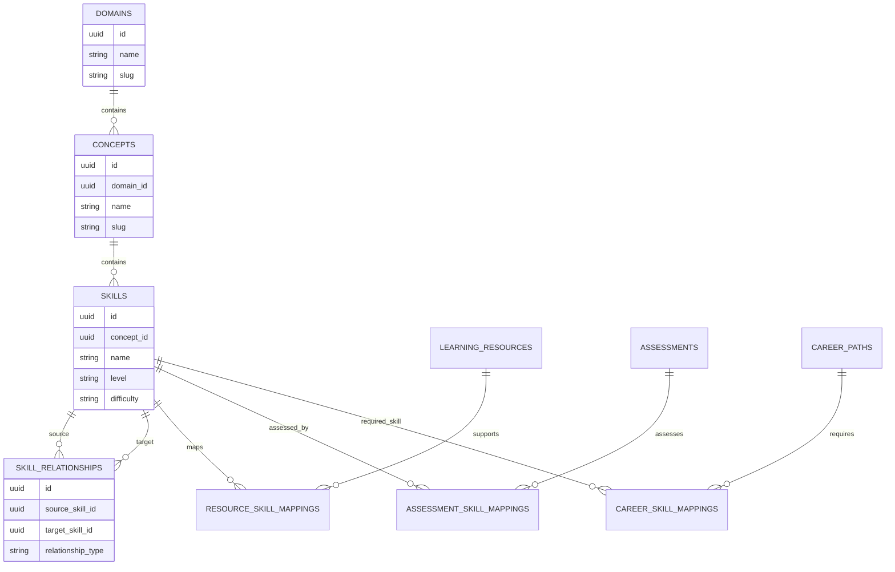
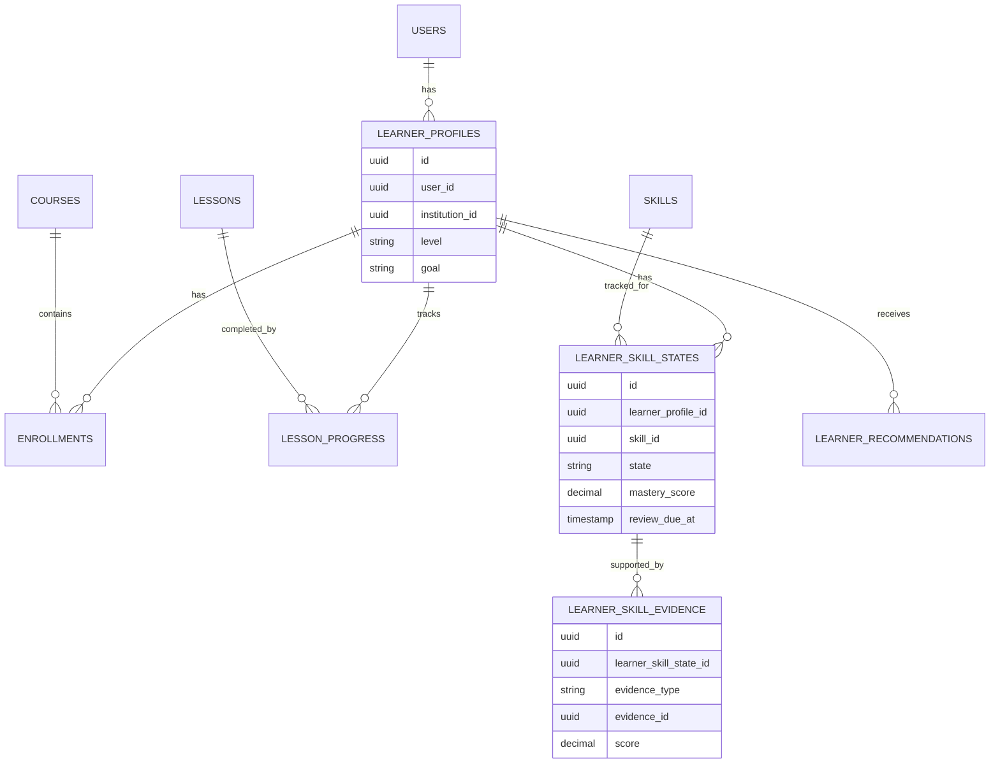
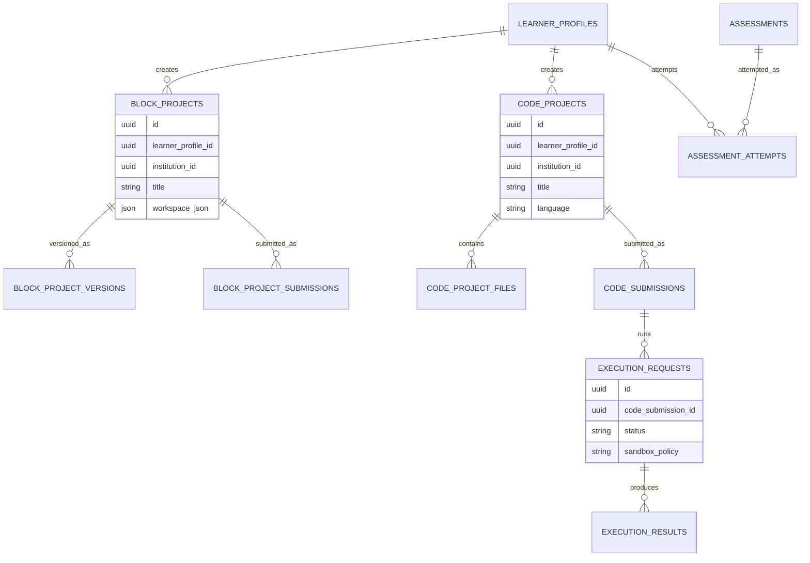
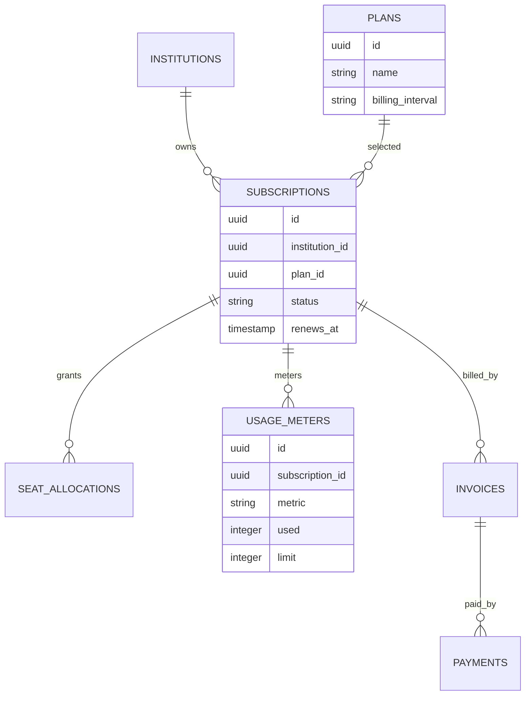
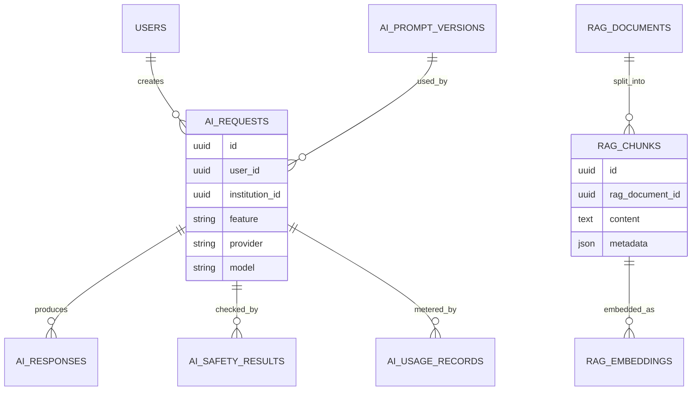

# Domain ERD

## Purpose

This document provides first-pass entity relationship diagrams for the core platform domains. These diagrams are conceptual and should guide detailed database migrations later.

## Institution And Identity

## Curriculum Knowledge Graph

## Learning Progress And Digital Twin

## Projects, Assessments, And Execution

## Subscriptions And Usage

## AI And RAG

## Next ERD Work

The next version should include:

- exact columns,
- indexes,
- foreign keys,
- delete behavior,
- tenant scoping,
- sync metadata,
- audit fields,
- migration order.
