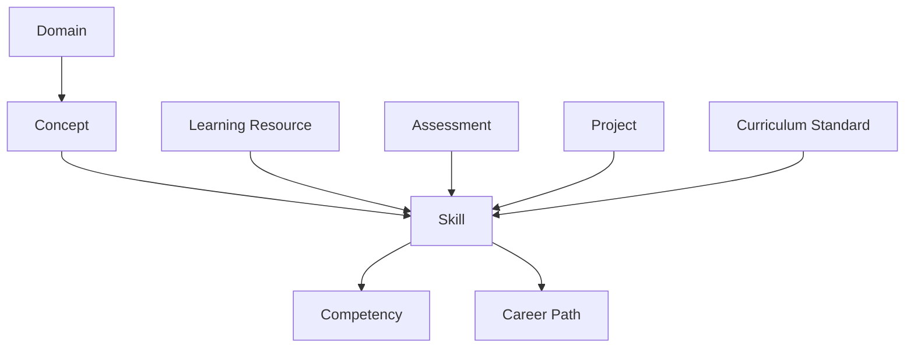
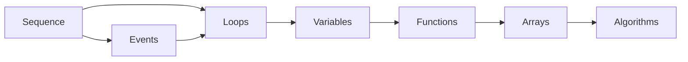
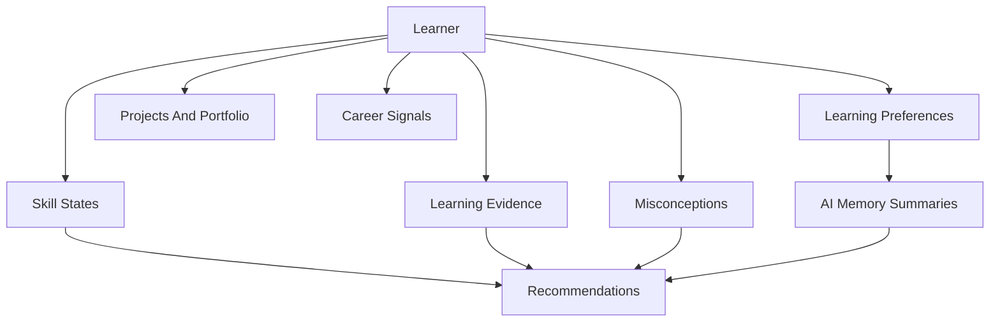
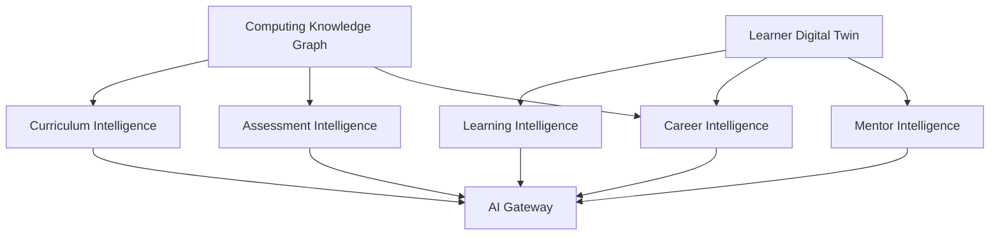
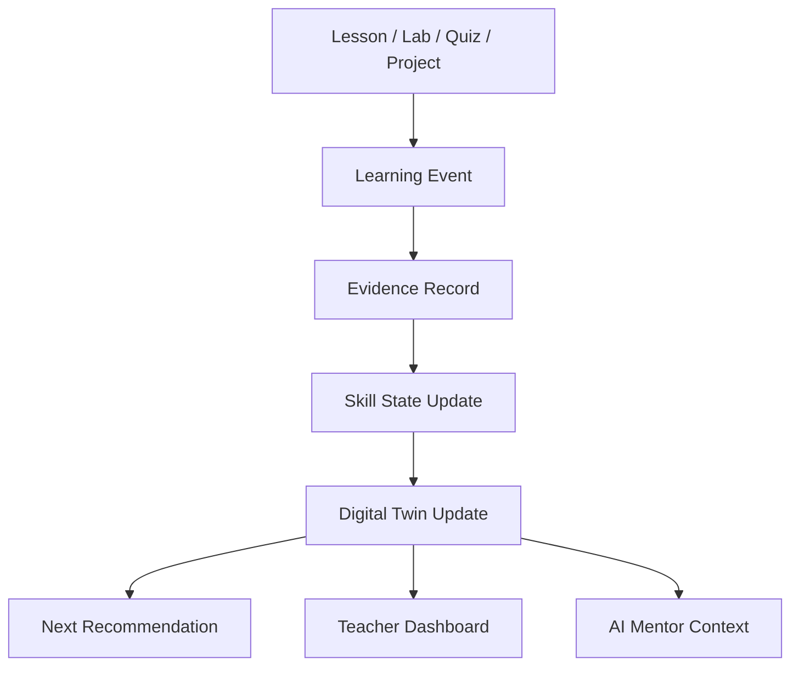

# Knowledge Graph And Learner Digital Twin Diagrams

## Computing Knowledge Graph

```mermaid
flowchart TD
    Domain[Domain]
    Concept[Concept]
    Skill[Skill]
    Competency[Competency]
    Resource[Learning Resource]
    Assessment[Assessment]
    Project[Project]
    Career[Career Path]
    Standard[Curriculum Standard]

    Domain --> Concept
    Concept --> Skill
    Skill --> Competency
    Resource --> Skill
    Assessment --> Skill
    Project --> Skill
    Skill --> Career
    Standard --> Skill
```

## Skill Relationships

```mermaid
flowchart LR
    Sequence[Sequence]
    Events[Events]
    Loops[Loops]
    Variables[Variables]
    Functions[Functions]
    Arrays[Arrays]
    Algorithms[Algorithms]

    Sequence --> Events
    Sequence --> Loops
    Events --> Loops
    Loops --> Variables
    Variables --> Functions
    Functions --> Arrays
    Arrays --> Algorithms
```

## Learner Digital Twin

```mermaid
flowchart TD
    Learner[Learner]
    SkillState[Skill States]
    Evidence[Learning Evidence]
    Misconceptions[Misconceptions]
    Preferences[Learning Preferences]
    Projects[Projects And Portfolio]
    Career[Career Signals]
    Recommendations[Recommendations]
    AIMemory[AI Memory Summaries]

    Learner --> SkillState
    Learner --> Evidence
    Learner --> Misconceptions
    Learner --> Preferences
    Learner --> Projects
    Learner --> Career
    SkillState --> Recommendations
    Evidence --> Recommendations
    Misconceptions --> Recommendations
    Preferences --> AIMemory
    AIMemory --> Recommendations
```

## Intelligence Engines

```mermaid
flowchart TD
    KG[Computing Knowledge Graph]
    Twin[Learner Digital Twin]
    Curriculum[Curriculum Intelligence]
    Learning[Learning Intelligence]
    Career[Career Intelligence]
    Assessment[Assessment Intelligence]
    Mentor[Mentor Intelligence]
    AI[AI Gateway]

    KG --> Curriculum
    KG --> Assessment
    KG --> Career
    Twin --> Learning
    Twin --> Career
    Twin --> Mentor
    Curriculum --> AI
    Learning --> AI
    Career --> AI
    Assessment --> AI
    Mentor --> AI
```

## Learning Event Flow

```mermaid
flowchart TD
    Activity[Lesson / Lab / Quiz / Project]
    Event[Learning Event]
    Evidence[Evidence Record]
    SkillUpdate[Skill State Update]
    TwinUpdate[Digital Twin Update]
    Recommendation[Next Recommendation]
    Teacher[Teacher Dashboard]
    AI[AI Mentor Context]

    Activity --> Event
    Event --> Evidence
    Evidence --> SkillUpdate
    SkillUpdate --> TwinUpdate
    TwinUpdate --> Recommendation
    TwinUpdate --> Teacher
    TwinUpdate --> AI
```
