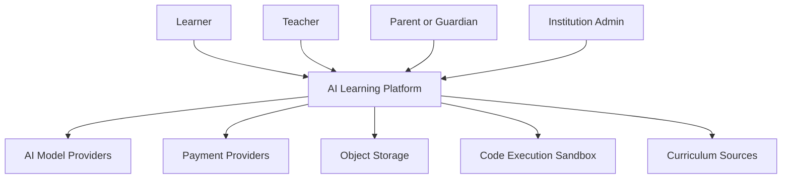
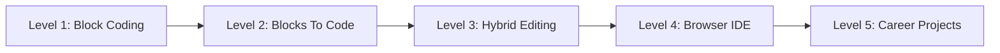
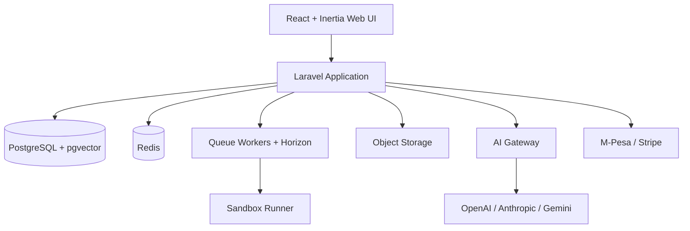
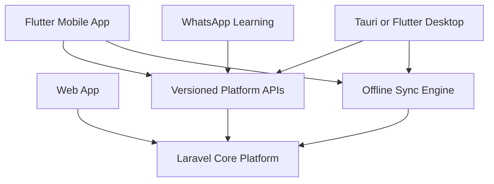
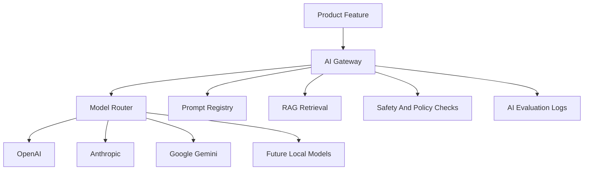

# System Context Diagrams

## Product Ecosystem

```mermaid
flowchart TD
    Learner[Learner]
    Teacher[Teacher]
    Parent[Parent or Guardian]
    Institution[Institution Admin]
    Platform[AI Learning Platform]
    AI[AI Model Providers]
    Payments[Payment Providers]
    Storage[Object Storage]
    Sandbox[Code Execution Sandbox]
    Curriculum[Curriculum Sources]

    Learner --> Platform
    Teacher --> Platform
    Parent --> Platform
    Institution --> Platform
    Platform --> AI
    Platform --> Payments
    Platform --> Storage
    Platform --> Sandbox
    Platform --> Curriculum
```

## Learning Progression

```mermaid
flowchart LR
    L1[Level 1: Block Coding]
    L2[Level 2: Blocks To Code]
    L3[Level 3: Hybrid Editing]
    L4[Level 4: Browser IDE]
    L5[Level 5: Career Projects]

    L1 --> L2 --> L3 --> L4 --> L5
```

## Initial Web Architecture

```mermaid
flowchart TD
    Browser[React + Inertia Web UI]
    Laravel[Laravel Application]
    Postgres[(PostgreSQL + pgvector)]
    Redis[(Redis)]
    Queue[Queue Workers + Horizon]
    R2[Object Storage]
    AIGateway[AI Gateway]
    Providers[OpenAI / Anthropic / Gemini]
    Sandbox[Sandbox Runner]
    Payments[M-Pesa / Stripe]

    Browser --> Laravel
    Laravel --> Postgres
    Laravel --> Redis
    Laravel --> Queue
    Laravel --> R2
    Laravel --> AIGateway
    AIGateway --> Providers
    Queue --> Sandbox
    Laravel --> Payments
```

## Future Channel Architecture

```mermaid
flowchart TD
    Web[Web App]
    Mobile[Flutter Mobile App]
    Desktop[Tauri or Flutter Desktop]
    WhatsApp[WhatsApp Learning]
    API[Versioned Platform APIs]
    Core[Laravel Core Platform]
    Sync[Offline Sync Engine]

    Web --> Core
    Mobile --> API
    Desktop --> API
    WhatsApp --> API
    API --> Core
    Mobile --> Sync
    Desktop --> Sync
    Sync --> Core
```

## AI Gateway

```mermaid
flowchart TD
    Feature[Product Feature]
    Gateway[AI Gateway]
    Router[Model Router]
    Prompt[Prompt Registry]
    RAG[RAG Retrieval]
    Safety[Safety And Policy Checks]
    Eval[AI Evaluation Logs]
    ProviderA[OpenAI]
    ProviderB[Anthropic]
    ProviderC[Google Gemini]
    ProviderD[Future Local Models]

    Feature --> Gateway
    Gateway --> Prompt
    Gateway --> RAG
    Gateway --> Safety
    Gateway --> Router
    Router --> ProviderA
    Router --> ProviderB
    Router --> ProviderC
    Router --> ProviderD
    Gateway --> Eval
```
